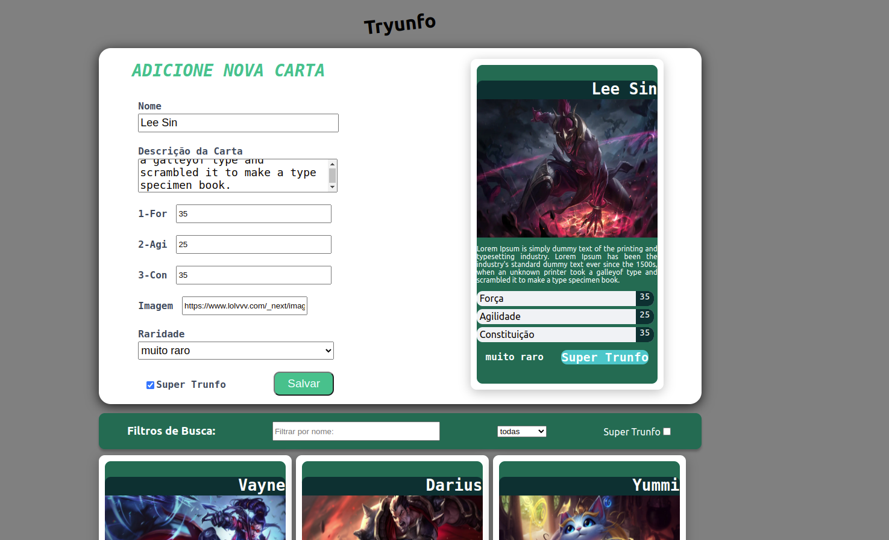
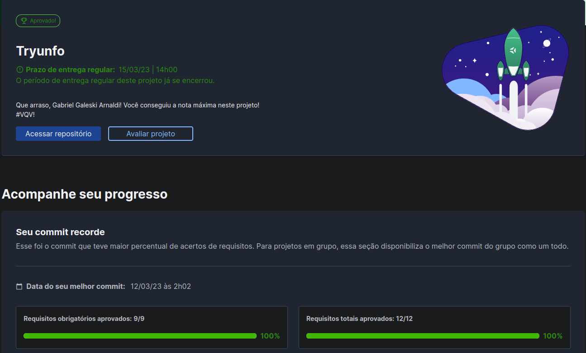

# :clubs: Tryunfo! :diamonds:

 

 

 

# :clipboard: About
O projeto tem como objetivo simular a criação de um baralho de Super Trunfo, onde segue algumas regras de negocio do proprio jogo, porem deixando a liberdade do jogador de criar sobre o que quiser, com a criação das cartas em tempo real, e visualização do baralho logo abaixo. O Projeto foi realizado em React.js e teve foco em formularios, com suas validações e formatações.
 
Para testar o site: <a href='https://gabgaleski-tryunfo.netlify.app/'>Clique Aqui<a/>

 

# :hammer_and_wrench: Skills & Tools

- HTML5
- CSS3
- JavaScript ES6+
- React.js

 

# :scroll: Nota

 
 
